<h1 align="center"><b>Bienvenidos a este Portafolio</b></h1>

Este es un sistema en el cual se le solicitan datos a los empleados y se validan estos mismo. Luego los guarda en un archivo de texto(.text) y tambien se puede abrir cualquiel archivo ya guardado de tipo texto(.text).
<h3>Datos del estudiante:<h3/>
<ul>
  <li>Oscar David Mota Reyes</li>
  <li>#13 de la lista</li>
  <li>5to D-2</li>
</ul>
 
  <h3>Datos de entrada del sistema:</h3>
<ul>
  <li>ID</li>
  <li>Nombres</li>
  <li>Apellido</li>
  <li>sexo</li>
  <li>Numeros</li>
  <li>Direcciones</li>
  <li>Correos</li>
  <li>cargo</li>
  <li>Salario</li>
  <li>Fecha de emision</li>
</ul>
 
  <h3>Datos de salida del sistema:</h3>
<ul>
  <li>Mensajes</li>
  <li>Archivos de texto</li>
</ul>
 
<h3>Anexos:</h3>
  
<h4>-Inicio</h4>
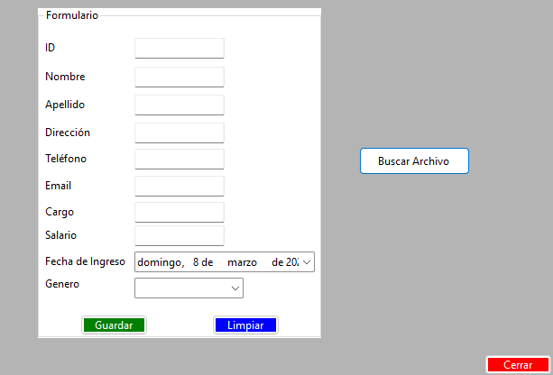
 
<h4>-Validaciones:</h4>
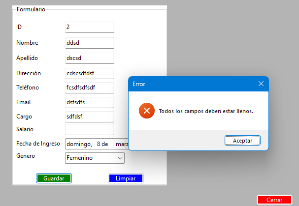
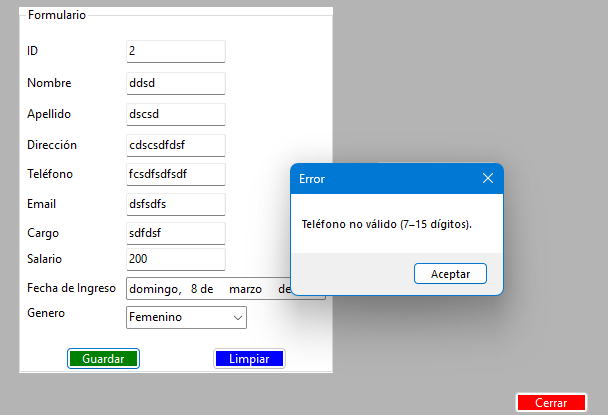
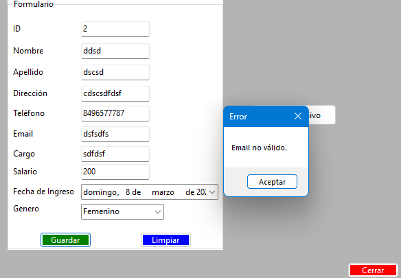 
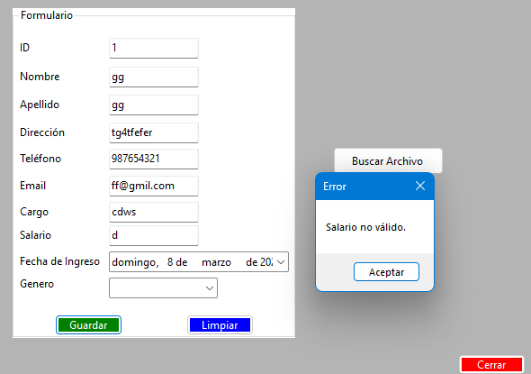 

 
<h4>-Al hacer click en el boton guardar:</h4>
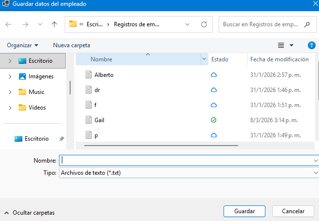
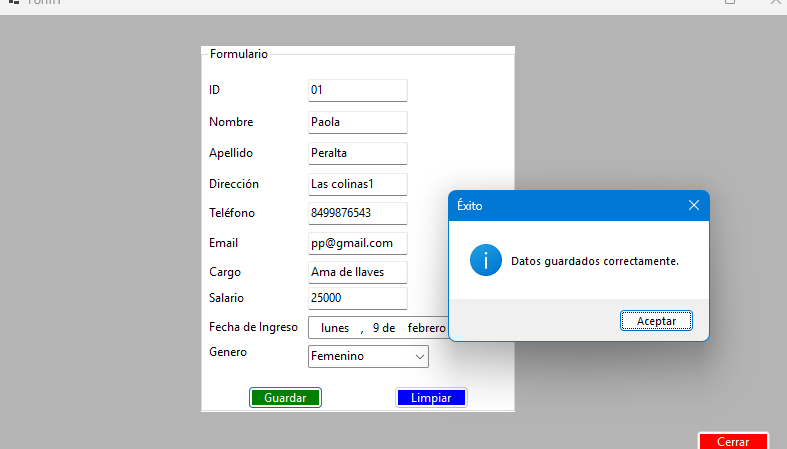
 
<h4>-Al hacer click en el boton buscar:</h4>
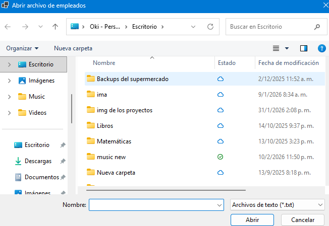
 
<h4>-Cuando habres el archivo:</h4>
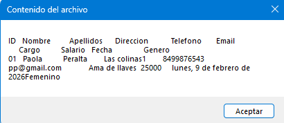
 
<h4>-Como se guarda en el bloc de notas:</h4>
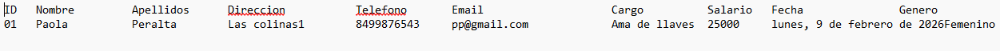
 
<h4>-Al hacer click en el boton salir:</h4>
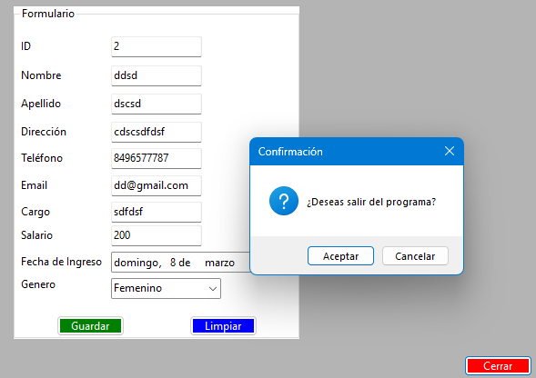
 

## <b>Gracias por visitar este portafolio</b>

